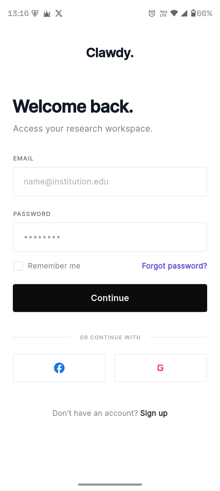
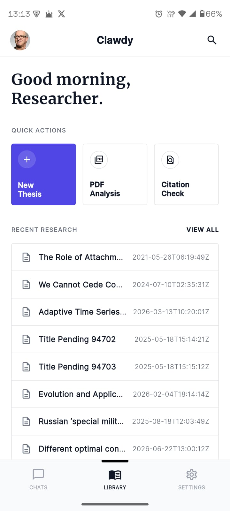
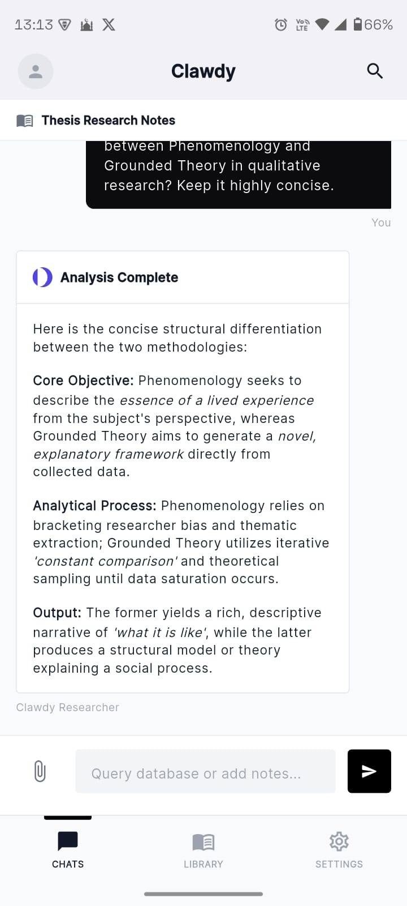
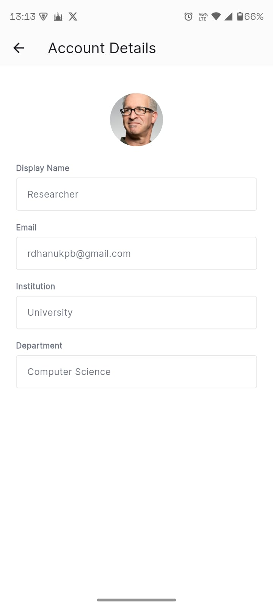

# Clawdy - Research Workspace App

## Description

Clawdy is a research workspace application designed specifically for academics, focusing on thesis management and AI-powered document analysis.

## Main Features

- **Login System**: Email/password authentication with SSO options (Google, Facebook), remember me functionality, forgot password and sign up links
- **Home Screen**: Main dashboard showing research activity summary with quick actions (New Thesis, PDF Analysis, Citation Check) and recent research list
- **AI Chat**: Context-aware chat interface for Q&A about saved research content, tied to specific documents

## Tech Stack

- Flutter 3.44.2
- Dart 3.12.2
- Android SDK

## Figma Design

[Click Here](https://www.figma.com/design/mdxuywxi6GNmPzKV6mQLTa/Clawdy?node-id=0-1&t=fpXm55GObkXO5hy6-1)

## Screens

1. **Login Screen** - Entry point for users to access their research workspace
2. **Home Screen** - Dashboard with quick actions and recent research list, bottom navigation (Chats, Library, Settings)
3. **AI Chat** - Context-aware chat interface with formatted AI responses (bold, italic) and attachment support

## Setup Instructions

1. Clone the repository:
   git clone https://github.com/RZID/clawdy.git
   cd clawdy

2. Get dependencies:
   flutter pub get

3. Run the app:
   flutter run

## Submission Requirements

| # | Requirement | Implementation |
|---|------------|----------------|
| 1 | UI/UX design from UTS | Figma design → [Clawdy](https://www.figma.com/design/mdxuywxi6GNmPzKV6mQLTa/Clawdy?node-id=0-1&t=fpXm55GObkXO5hy6-1), all screens implemented in Flutter |
| 2 | Flutter framework | Flutter 3.44.2 / Dart 3.12.2, native Android & iOS builds |
| 3 | Software Architecture (MVC minimum) | Feature-based architecture with Models (`ResearchModel`), Views (screens), Controllers (`AppController`, `LibraryController`, `CameraController`, `AuthController`), and Services (`AuthService`, `ResearchService`, `StorageService`, `CameraService`) |
| 4 | State Management (Provider minimum) | Provider `^6.1.2` via `MultiProvider` with 3 `ChangeNotifierProvider`s, consumed via `context.read()`, `context.watch()`, and `Consumer` |
| 5 | API Integration (1+ list data feature) | CrossRef API (`api.crossref.org/works`) returns `List<ResearchModel>`, displayed in `ListView.separated` on Library screen with search and detail navigation |
| 6 | Local Storage | `flutter_secure_storage` for session token; `shared_preferences` for `is_logged_in` and `user_email` — session restored on app start via `AppController.checkSession()` |
| 7 | Mobile Feature (Camera) | `image_picker` `^1.1.2` with `CAMERA` permission configured on Android (`AndroidManifest.xml`) and iOS (`Info.plist`), used for document capture in PDF Analysis flow |
| 8 | GitHub repository | Pushed to `https://github.com/RZID/clawdy.git` with semantic commits |
| 9 | Screenshots | App screenshots included below and in `images/` directory |

## Software Architecture

The project follows a **feature-based structure** that separates core infrastructure from feature-specific code:

```
lib/
├── core/                          # Shared infrastructure
│   ├── constants/                 # App-wide constants (colors, strings)
│   ├── controllers/               # App-level state (AppController)
│   ├── models/                    # Data models (ResearchModel)
│   ├── services/                  # Business logic (auth, API, storage, camera)
│   └── theme/                     # App theming
└── features/                      # Feature modules
    ├── auth/                      # Login & session management
    │   ├── controllers/           # AuthController
    │   └── screens/               # WelcomeScreen
    ├── chat/                      # AI chat interface
    │   ├── controllers/           # CameraController
    │   └── screens/               # ChatScreen
    ├── dashboard/                 # Library & research
    │   ├── controllers/           # LibraryController
    │   └── screens/               # LibraryScreen
    └── main/                      # Navigation shell
        └── screens/               # MainNavigationScreen
```

This structure ensures each feature is self-contained with its own controllers and screens, while shared infrastructure lives in `core/`. Adding a new feature means creating a new folder under `features/` without touching unrelated code.

## State Management

The app uses **Provider** (`provider: ^6.1.2`) for reactive state management:

| Controller          | Purpose                             | Key State                                           |
| ------------------- | ----------------------------------- | --------------------------------------------------- |
| `AppController`     | Auth state, session, tab navigation | `isLoggedIn`, `userEmail`, `currentTab`, `messages` |
| `LibraryController` | Research data fetching              | `researchItems`, `isLoading`, `error`               |
| `CameraController`  | Document capture                    | `capturedImage`                                     |

All controllers extend `ChangeNotifier` and are registered via `MultiProvider` in `main.dart`. The `SplashDecider` widget reads `AppController` on startup to restore session and route to the correct screen.

## API Integration

The app integrates with the **CrossRef API** (`https://api.crossref.org/works`) to fetch recent research papers:

```dart
GET https://api.crossref.org/works?query=$query&rows=$rows&sort=published&order=desc
```

The response is parsed into `ResearchModel` objects via `ResearchModel.fromJson()`, which extracts:

- `title` — from the `title` array (first element)
- `authors` — from the `author` array, combining `given` and `family` names
- `publishedDate` — from `created["date-time"]`
- `doi` — from the `DOI` field
- `url` — from the `URL` field

The `LibraryController.fetchRecentResearch()` method handles the HTTP call, loading state, and error handling.

## Local Storage

Session persistence uses two storage solutions:

- **`flutter_secure_storage`** — Stores the session token (`session_token` key) with encrypted storage for sensitive data
- **`shared_preferences`** — Stores `is_logged_in` (bool) and `user_email` (string) for quick session checks

The `StorageService` class provides a static API for all storage operations. On app start, `AppController.checkSession()` reads from `shared_preferences` to restore the login state, eliminating the need to re-enter credentials.

## Mobile Feature: Camera Document Capture

The app uses `image_picker` (`^1.1.2`) for document capture:

- `CameraService.pickImageFromCamera()` opens the device camera and returns a `File` or `null` if cancelled
- `CameraController.captureDocument()` manages the captured image state
- The "PDF Analysis" quick action on the Library screen triggers capture and displays the result in a dialog

Native camera permissions are configured for both platforms:

- **Android**: `CAMERA` permission and `FileProvider` added to `AndroidManifest.xml`
- **iOS**: `NSCameraUsageDescription` added to `Info.plist`

## Screenshots

| Preview 1 | Preview 2 |
|---|---|
|  |  |

| Preview 3 | Preview 4 |
|---|---|
|  |  |

## Author

Ramadhanu
24120310004

## Submission Date

July 12, 2026
